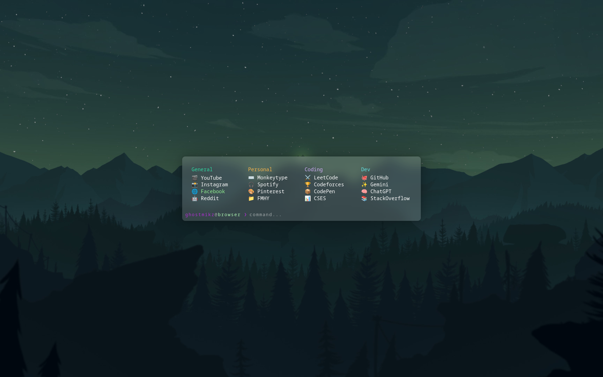

# Terminal Startpage

This repository contains a minimalist, terminal-themed browser startpage. It features a blurred UI, custom categories, and a functional command-line interface for navigation and searching.



## Repository Structure

* `assets/` – Contains visual assets (e.g., `bg-terminal.jpg`)
* `index.html` – The core structure, styling, and logic of the startpage
* `README.md` – Project documentation and instructions

## Tech Stack

* **HTML5** – Page structure
* **CSS3** – Glassmorphism UI and terminal-themed styling
* **JavaScript (Vanilla)** – Command filtering, shortcut logic, and Google search integration

## How to Use

1. Clone this repository to your local machine.
2. Set the `index.html` file as your browser's custom new tab page (using an extension like *Custom New Tab*).
3. Interact with the terminal:
* **Type a shortcut:** Type `yt` or `gh` and press **Enter** to jump to YouTube or GitHub.
* **Filter:** Type any letter to dim links that don't match your input.
* **Search:** Type anything that isn't a shortcut and press **Enter** to search Google.

```
# To preview the startpage locally:
# Open index.html in your preferred browser
open index.html

```

---
